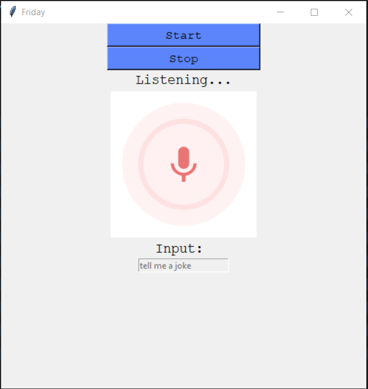

<h3 align="center">F.R.I.D.A.Y</h3>

<p align="center">
    A personal desktop assistant at your service!
    <br />
    <a href="https://github.com/harshil-270/Desktop-Assistant">View demo</a>
    ·
    <a href="https://github.com/harshil-270/Desktop-Assistant/issues">Report Bug</a>
    ·
    <a href="https://github.com/harshil-270/Desktop-Assistant/issues">Request Feature</a>   </p>

<!-- TABLE OF CONTENTS -->
<details open="open">
  <summary>Table of Contents</summary>
  <ol>
    <li>
      <a href="#about-the-project">About The Project</a>
      <ul>
        <li><a href="#features">Features</a></li>
        <li><a href="#screenshot">Screenshot</a></li>
        <li><a href="#built-with">Built With</a></li>
      </ul>
    </li>
    <li>
      <a href="#getting-started">Getting Started</a>
      <ul>
        <li><a href="#prerequisites">Prerequisites</a></li>
        <li><a href="#installation">Installation</a></li>
      </ul>
    </li>
    <li><a href="#contact">Contact</a></li>
    <li><a href="#acknowledgements">Acknowledgements</a></li>
  </ol>
</details>

<!-- ABOUT THE PROJECT -->

## About The Project

F.R.I.D.A.Y is a personal desktop assistant that listens to your commands and gives the required output. <br> It has various features with a built-in GUI that listens to you.

### Features

-   Weather
-   News update
-   Google search
-   Open youtube
-   Open webbrowser
-   Date and Time
-   Coin flip
-   Jokes
-   Restart and shutdown

### Screenshot



### Built With

Libraries used to build the project

-   [Tkinter](https://docs.python.org/3/library/tkinter.html)
-   [Pyttsx3](https://pypi.org/project/pyttsx3/)
-   [SpeechRecognition](https://pypi.org/project/SpeechRecognition/)

<!-- GETTING STARTED -->

## Getting Started

### Prerequisites

Install python from https://www.python.org/<br> Thereafter install the following

-   pyjokes
    ```sh
    pip install pyjokes
    ```
-   pyttsx3
    ```sh
    pip install pyttsx3
    ```
-   SpeechRecognition

    ```sh
    pip install SpeechRecognition
    ```

-   pyaudio

    ```sh
    pip install pyaudio
    ```

    If you face any issues in installing pyaudio, please refer <a href="https://stackoverflow.com/questions/52283840/i-cant-install-pyaudio-on-windows-how-to-solve-error-microsoft-visual-c-14">this</a>

### Installation

To run the weather command, you need to get your free API key.

1. Get a free API Key at [Open weather](https://openweathermap.org/api)
2. Clone the repo
    ```sh
    git clone https://github.com/harshil-270/Desktop-Assistant.git
    ```
3. Enter your API in `main.py`
    ```JS
    weather_api_key = "ENTER YOUR API KEY HERE"
    ```

<!-- CONTACT -->

## Contact

Harshil Tagadiya - 19bce270@nirmauni.ac.in <br>
Smit Shah - 19bce259@nirmauni.ac.in<br>
Tilak Tejani - 19bce273@nirmauni.ac.in

<!-- ACKNOWLEDGEMENTS -->

## Acknowledgements

We would like to express my special thanks of gratitude to our professor (Mr. Mohd Zuhair) as well as our lab professor (Mr. Ajay Patel) <br>who gave us the golden opportunity to do this wonderful project which also helped us in doing a lot of Research and came to know about so many new stuff.<br>
